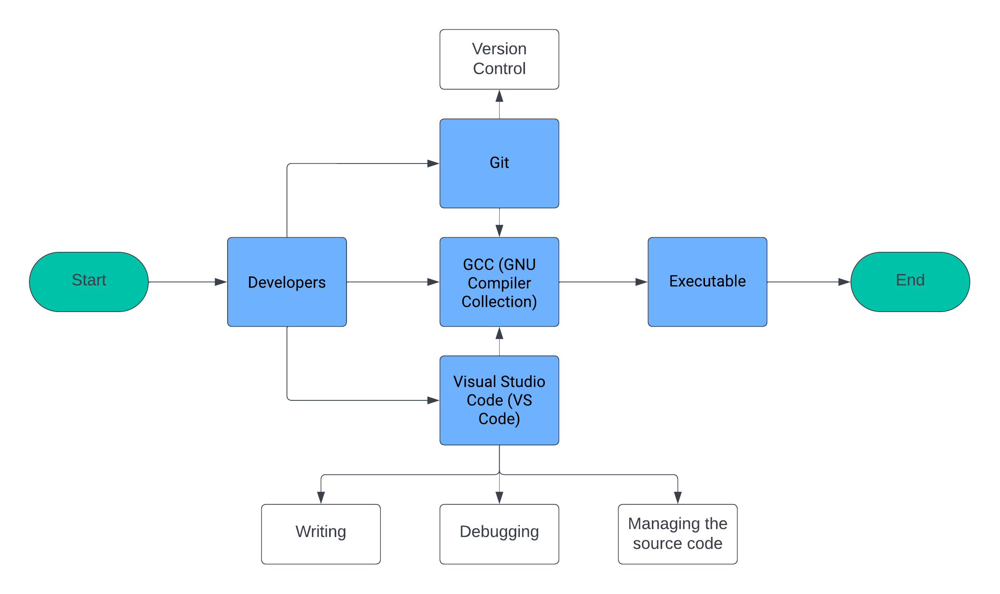

# Functional Specification - Team 5's Virtual Processor

|              |              |
| ------------ | :----------: |
| Author       | Rémy CHARLES |
| Reviewers    |              |
| Created on   |  2024-01-12  |
| Last updated |  2024-01-22  |

## Table of contents

<details>

<summary>Click to expand</summary>

- [Functional Specification - Team 5's Virtual Processor](#functional-specification---team-5s-virtual-processor)
  - [Table of contents](#table-of-contents)
  - [1. Introduction](#1-introduction)
  - [2. Development Environment](#2-development-environment)
  - [3. Assembly Language Specification](#3-assembly-language-specification)
    - [3.1. Instructions](#31-instructions)
    - [3.2. Operations](#32-operations)
  - [4. C Program Development](#4-c-program-development)
    - [4.1 Program Structure](#41-program-structure)
    - [4.2 Reading Assembly Code](#42-reading-assembly-code)
    - [4.3 Executing Instructions](#43-executing-instructions)
    - [4.4 Error Handling and Reporting](#44-error-handling-and-reporting)
    - [4.5 Debugging and Logging](#45-debugging-and-logging)
  - [5. Virtual System Call Implementation](#5-virtual-system-call-implementation)
    - [5.1 Text Display](#51-text-display)
      - [Functionality:](#functionality)
      - [Advanced Features:](#advanced-features)
    - [5.2 Debugging Features](#52-debugging-features)
      - [Comprehensive Tools:](#comprehensive-tools)
      - [User Guide:](#user-guide)
    - [5.3 I/O Operations](#53-io-operations)
      - [Input Handling:](#input-handling)
      - [Output Procedures:](#output-procedures)
    - [5.4 Extension Mechanisms](#54-extension-mechanisms)
      - [Extensibility Framework:](#extensibility-framework)
      - [Customization Strategies:](#customization-strategies)
  - [7. Conclusion](#7-conclusion)
  - [8. Glossary](#8-glossary)


</details>


## 1. Introduction

The purpose of this document is to provide a comprehensive functional specification for Team 5's Virtual Processor Project. This project involves the creation of a virtual processor designed to execute assembly code. The processor must to be developed in the C programming language, adhering to principles of portability and efficiency. This document outlines the essential elements and specifications of the project, including the development environment, assembly language design, and implementation details.

The virtual processor aims to offer a simplified yet functional platform for understanding and executing basic assembly instructions. It serves as an educational tool, facilitating the learning of low-level programming concepts. The processor will be equipped to handle a custom assembly language, which will be fully detailed in this specification. The project will emphasize the importance of efficient programming practices and the intricacies of processor design and operation.

This specification serves as a guideline for developers and contributors to understand the project's goals, requirements, and design philosophy. It will ensure that all aspects of the project align with the outlined objectives and standards.

## 2. Development Environment

The development of the Virtual Processor will be conducted in a specific programming and toolset environment to ensure consistency, compatibility, and performance. The key components of this environment are:

- **Programming Language**: The entire project is to be developed in standard C language. This choice is made to leverage the portability and efficiency of C, making the virtual processor adaptable to various platforms.

- **Compiler**: The GNU Compiler Collection (GCC) is designated as the primary compiler. Its widespread availability and compatibility with various operating systems make it an ideal choice.

- **Integrated Development Environment (IDE)**: Visual Studio Code (VS Code) is recommended for its versatility and robust support for C/C++ development. It offers valuable features like debugging tools and source code management integration.

- **Libraries**: Only standard C libraries are to be used in this project. The use of external or third-party libraries is restricted to ensure the simplicity and portability of the code.

- **Version Control**: Git, in conjunction with GitHub, will be used for source code management. This allows for effective collaboration, version tracking, and code review processes.

- **Code Style and Conventions**: Adherence to common C programming conventions is expected to maintain code readability and maintainability. A specific style guide will be provided to ensure consistency across the project.

This environment is chosen to balance functionality, ease of use, and accessibility for developers. It will support the project's goals of creating a portable and efficient virtual processor.



*In the development workflow, developers use Visual Studio Code (VS Code) to write and manage code. Git handles version control, facilitating collaboration and code tracking. Changes are committed, branched, and merged. The GNU Compiler Collection (GCC) compiles code into an executable binary. This streamlined process ensures efficient project development.*

## 3. Assembly Language Specification

The virtual processor will be equipped to handle a custom assembly language. This language will be designed to be simple and intuitive, allowing for easy comprehension and execution. The language will be fully detailed in this section, including instructions, operations, and syntax.

### 3.1. Instructions

The assembly language designed for the Virtual Processor will include a set of fundamental instructions. These instructions form the core functionality of the language, enabling basic programming operations. The instruction set is designed to be minimal yet sufficient for a wide range of tasks. Key aspects include:

- **Data Movement Instructions**: These will include instructions for loading and storing data, moving data between registers, and handling immediate values. 

    1. **``mov`` (Move Data)**
    - Source Operand --> Destination Operand
    - Operation: Copy data from source to destination.

    2. **``ldr`` (Load from Memory)**
    - Memory Location (Address) --> Register
    - Operation: Load data from memory into the register.

    3. **``str`` (Store to Memory)**
    - Register --> Memory Location (Address)
    - Operation: Store data from register into memory.

    4. **``push`` (Push onto Stack)**
    - Register --> Stack
    - Operation: Push data from register onto the stack.

    5. **``pop`` (Pop from Stack)**
    - Stack --> Register
    - Operation: Pop data from stack into the register.

    6. **``lea`` (Load Effective Address)**
    - Memory Location (Address) --> Register
    - Operation: Load the address into the register.

    7. **``ldi`` (Load Immediate)**
    - Immediate Value --> Register
    - Operation: Load immediate value into the register.


- **Arithmetic Operations**: Basic arithmetic instructions such as addition, subtraction, multiplication, and division will be implemented.
  
   1. **``add`` (Addition)**
   - Source Operand 1 + Source Operand 2 --> Destination Operand
   - Operation: Add values and store the result.

  1. **``sub`` (Subtraction)**
   - Source Operand 1 - Source Operand 2 --> Destination Operand
   - Operation: Subtract values and store the result.

  2. **``mul`` (Multiplication)**
   - Source Operand 1 * Source Operand 2 --> Destination Operand
   - Operation: Multiply values and store the result.

  3. **``div`` (Division)**
   - Source Operand 1 / Source Operand 2 --> Destination Operand
   - Operation: Divide values and store the result.

- **Logical Operations**: Instructions for logical operations like AND, OR, XOR, and NOT are included.
  
    1. **``and`` (Logical AND)**
     - Source Operand 1 AND Source Operand 2 --> Destination Operand
     - Operation: Perform logical AND.

    2. **``or`` (Logical OR)**
     - Source Operand 1 OR Source Operand 2 --> Destination Operand
     - Operation: Perform logical OR.

    3. **``xor`` (Logical XOR)**
     - Source Operand 1 XOR Source Operand 2 --> Destination Operand
     - Operation: Perform logical XOR.

    4. **``not`` (Logical NOT)**
     - NOT Source Operand --> Destination Operand
     - Operation: Perform logical NOT.

- **Control Flow**: Instructions for branch, jump, and call operations will facilitate the control flow within the assembly programs. 
  
    1. **``jmp`` (Jump)**
     - Destination Operand --> Program Counter
     - Operation: Jump to the specified address.

    2. **``jz`` (Jump if Zero)**
     - Destination Operand --> Program Counter
     - Operation: Jump to the specified address if the zero flag is set.

    3. **``jnz`` (Jump if Not Zero)**
     - Destination Operand --> Program Counter
     - Operation: Jump to the specified address if the zero flag is not set.

    4. **``je`` (Jump if Equal)**
     - Destination Operand --> Program Counter
     - Operation: Jump to the specified address if the equal flag is set.

    5. **``jne`` (Jump if Not Equal)**
     - Destination Operand --> Program Counter
     - Operation: Jump to the specified address if the equal flag is not set.

    6. **``call`` (Call Subroutine)**
     - Destination Operand --> Program Counter
     - Operation: Call the subroutine at the specified address.

    7. **``ret`` (Return from Subroutine)**
     - Stack --> Program Counter
     - Operation: Return from the subroutine.

- **Special Instructions**: A set of special instructions for system calls, input/output operations, and other processor-specific tasks. 
  
    1. **``syscall`` (System Call)**
     - System Call Number --> System Call Handler
     - Operation: Invoke the specified system call.

    2. **``in`` (Input)**
     - Input Device --> Register
     - Operation: Read input from the specified device.

    3. **``out`` (Output)**
     - Register --> Output Device
     - Operation: Write output to the specified device.

    4. **``nop`` (No Operation)**
     - No Operation
     - Operation: Do nothing.

    5. **``hlt`` (Halt)**
     - Halt
     - Operation: Halt the processor. 

*Each instruction will be described in detail, including its syntax, operation, and usage examples. This will ensure a clear understanding of how to program using the Virtual Processor's assembly language.*

### 3.2. Operations

The operations of the assembly language define how each instruction manipulates data and controls the flow of the program. This section will detail the operational characteristics of the assembly language, which are critical for the Virtual Processor’s functionality:

- **Register Operations**: Detailed explanations of how instructions interact with registers, including register loading, storing, and manipulation. Registers' name: 
    - ``R0`` - ``R7``: General-purpose registers
    - ``PC``: Program counter
    - ``LR``: Link register
    - ``PSR``: Processor status register
    - ``USP``: User stack pointer
    - ``SSP``: Supervisor stack pointer

- **Memory Operations**: Descriptions of instructions for memory access, including direct and indirect addressing, and memory management techniques. 
  
- **Arithmetic and Logical Operations**: Clarification on how arithmetic and logical instructions process data, including flags affected, and overflow handling. Arithmetic instructions include ```add```, ```sub```, ```mul```, and ```div```. Logical instructions include ```and```, ```or```, ```xor```, and ```not```.

- **Control Flow Operations**: Insight into how jump, branch, and call instructions manage the program flow, including condition checks and subroutine handling. ```jmp```, ```jz```, ```jnz```, ```je```, ```jne```, ```call```, and ```ret``` are included.

- **System-Level Operations**: Overview of operations related to system calls and I/O handling, essential for interacting with the system and external environment. System call instructions include ```syscall```, ```in```, ```out```, ```nop```, and ```hlt```.

*Each operation will be described in the context of its effect on the processor state, including any changes to registers, memory, or the program counter. Examples will be provided to illustrate typical use cases and expected outcomes.*

## 4. C Program Development

The C program is essential for the Virtual Processor, acting as the interface for interpreting and executing the assembly language. This section details its intricate design and comprehensive implementation.

### 4.1 Program Structure
- **Overview:** This part describes the overarching structure of the C program, emphasizing modularity and efficient processing.
- **Modules:**
    - `Interpreter Loop`: The main loop that repeatedly reads and executes assembly instructions, acting as the heart of the program.
    - `Instruction Set Handler`: Decodes and processes each instruction, translating assembly language into executable actions.
    - `Memory Management`: Manages the virtual memory system, including allocation, access, and deallocation, ensuring efficient memory usage.

### 4.2 Reading Assembly Code
- **Parsing Method:** Explains the sophisticated parsing mechanism used to interpret the assembly language, including lexical analysis and syntax parsing.
- **Error Detection:**
    - `Syntax Analysis`: Details the method for identifying syntax errors, ensuring adherence to assembly language specifications.
    - `Semantic Checks`: Describes the process for logical validation, ensuring that the instructions make sense within the context of the language.

### 4.3 Executing Instructions
- **Instruction Interpretation:** This subsection breaks down how the C program interprets and executes each type of instruction in the assembly language.
- **Operational Handling:**
    - `Register Operations`: Discusses how the program manages data in registers, ensuring accurate and efficient data manipulation.
    - `Control Flow Management`: Elaborates on handling jumps, loops, and conditional executions within the program.

### 4.4 Error Handling and Reporting
- **Runtime Errors:** Outlines the strategies for catching and addressing errors during the program's execution. That includes syntax errors, semantic errors, and runtime errors. 
- **Reporting Mechanism:** Details the comprehensive error reporting system, designed to provide clear and actionable information to the user.

### 4.5 Debugging and Logging
- **Debugging Tools:** Describes the built-in debugging tools, including breakpoints, step execution, and state inspection, to facilitate troubleshooting. 
- **Logging System:** Explores the logging mechanism, which records execution details, aiding in post-execution analysis and debugging.

*In-depth understanding of the C program's development is crucial for ensuring the effective operation and reliability of the Virtual Processor.*

## 5. Virtual System Call Implementation

This section elaborates on the implementation of virtual system calls within the Virtual Processor, key to bridging the assembly program and the virtual environment.

### 5.1 Text Display

#### Functionality:
The text display system call is a pivotal component of the Virtual Processor, enabling the output of text to the virtual screen. This functionality encompasses a wide range of features that contribute to a rich and interactive user experience. Some of the core functionalities include:

- **Text Rendering:** The system call can render text on the virtual screen, supporting various fonts and character sizes.
- **Formatting:** Users can apply formatting to the displayed text, including font styles (bold, italic), alignment, and line spacing.
- **Color Control:** The system call allows for precise control over text and background colors, facilitating visual distinction and highlighting of text.
- **Cursor Management:** Users can control the position and behavior of the text cursor, making it easy to implement text-based interfaces and user interactions.
- **Scrolling:** The system call supports scrolling of text when the content exceeds the visible screen area.

#### Advanced Features:
In addition to the fundamental text display capabilities, the system call offers advanced features to enhance user interactions and create dynamic virtual environments:

- **Interactive Input:** Users can create interactive text-based forms and menus, where the cursor can be moved to specific input fields, and users can provide input via keyboard or other input methods.
- **Animation:** The system call allows for text-based animation, enabling the creation of dynamic and engaging virtual environments.
- **Screen Clearing:** Users can clear the screen or specific regions, making it easy to refresh the display and create responsive user interfaces.
- **Cursor Effects:** The cursor can be customized with different shapes, colors, and blinking patterns to provide visual cues to the user.
- **Text Effects:** Users can apply text effects such as text shadows, outlines, and gradients to enhance the visual appeal of text elements.

### 5.2 Debugging Features

#### Comprehensive Tools:
The debugging features provided by the Virtual Processor's system calls are extensive and essential for effective program development and troubleshooting. These tools include:

- **Real-Time Variable Tracking:** Developers can monitor the values of variables and registers in real-time as the program executes, allowing for quick identification of issues.
- **Stack Trace Analysis:** The system call provides detailed stack trace information, showing the call hierarchy of functions and procedures, aiding in identifying the source of errors.
- **Conditional Breakpoints:** Developers can set breakpoints at specific points in the code and specify conditions for when the program should pause, allowing for precise debugging.

#### User Guide:
To make the best use of these debugging tools, a comprehensive user guide is provided. This guide offers step-by-step instructions on how to leverage the debugging features effectively. It includes:

- **Setting Breakpoints:** A detailed explanation of how to set breakpoints at specific lines of code or memory addresses and configure conditions for breaking.
- **Variable Inspection:** Instructions on how to inspect the values of variables and registers during program execution, including viewing variable contents and their memory addresses.
- **Stack Trace Examination:** Guidance on analyzing the stack trace to identify function calls and their sequence.
- **Handling Runtime Errors:** Instructions on handling runtime errors, including suggestions for common debugging scenarios and strategies for error resolution.
- **Interactive Debugging:** Tips on using the interactive debugging interface, including stepping through code, examining memory contents, and modifying variables for testing purposes.

### 5.3 I/O Operations

#### Input Handling:
The I/O system calls in the Virtual Processor cater to various forms of input, including keyboard input and file-based inputs. Key functionalities include:

- **Keyboard Input:** The system call provides mechanisms to capture keyboard input from the user. It allows for the detection of keystrokes, including key codes and characters entered.
- **File-Based Input:** Users can interact with files, reading data from external files and processing them within the virtual environment. This feature supports reading data records and configuration files.

#### Output Procedures:
Output management is a crucial aspect of the I/O system calls, ensuring that data is displayed or stored efficiently. Key procedures include:

- **Display Output:** The system call supports the display of text, data, and graphics on the virtual screen. Users can control the positioning of output and apply formatting to enhance readability.
- **File Output:** Users can write data to external files, allowing for data storage and retrieval. This feature is useful for logging and data persistence.
- **Error Handling:** The I/O system calls include error handling mechanisms to address issues such as file not found, permission denied, or disk full. Clear error messages are provided to aid in issue resolution.

### 5.4 Extension Mechanisms

#### Extensibility Framework:
The architecture of the Virtual Processor's system calls is designed with extensibility in mind. This framework allows for the seamless addition of new system calls to enhance the processor's functionality. Key components of the extensibility framework include:

- **API for System Calls:** A well-defined API allows developers to create custom system calls by providing access to essential functions and resources.
- **System Call Registration:** Developers can register new system calls with the Virtual Processor, making them available for use within assembly programs.
- **Resource Management:** The framework manages system resources efficiently, ensuring that custom system calls do not conflict with existing ones.

#### Customization Strategies:
In addition to adding new system calls, developers can customize existing system calls to meet specific operational requirements. This customization can involve:

- **Parameterization:** Adjusting system call parameters to tailor their behavior to specific use cases.
- **Event Handling:** Defining custom event handlers to respond to specific events triggered by system calls.
- **User Interface Customization:** Modifying the appearance and behavior of system call interfaces to align with application requirements.

Enhancing the Virtual Processor's capabilities through these system calls ensures a versatile and user-friendly programming environment, allowing developers to create a wide range of applications and simulations within the virtual environment. These features empower users to build interactive, responsive, and feature-rich programs while streamlining the debugging and I/O processes.


## 7. Conclusion

In this functional specification, we have laid out a detailed roadmap for the creation of Team 5's Virtual Processor. This document comprehensively covers the development environment, assembly language specifications, C program development, and the implementation of virtual system calls. Our approach ensures that the Virtual Processor will be a powerful tool for understanding and executing assembly language, providing both educational value and practical application. As we move into the development phase, this specification will serve as a foundational guide, ensuring that all project elements align with our outlined objectives and meet the requirements of the call for tender. With a clear focus on efficiency, portability, and user-friendliness, Team 5 is set to deliver a Virtual Processor that is both robust and versatile, catering to a wide array of learning and development needs.

## 8. Glossary

| Term                    | Definition                                                                                                                                                                                           |
| ----------------------- | ---------------------------------------------------------------------------------------------------------------------------------------------------------------------------------------------------- |
| **C Language**          | A general-purpose, procedural computer programming language supporting structured programming, lexical variable scope, and recursion, with a static type system.                                     |
| **GCC**                 | The GNU Compiler Collection (GCC) is a compiler system produced by the GNU Project supporting various programming languages.                                                                         |
| **IDE**                 | An integrated development environment (IDE) is a software application that provides comprehensive facilities to computer programmers for software development.                                       |
| **VS Code**             | Visual Studio Code is a free source-code editor made by Microsoft for Windows, Linux, and macOS.                                                                                                      |
| **Git**                 | Git is a distributed version-control system for tracking changes in source code during software development.                                                                                         |
| **GitHub**              | GitHub is a provider of Internet hosting for software development and version control using Git.                                                                                                     |
| **Assembly Language**   | A low-level programming language for a computer or other programmable device, in which there is a very strong correspondence between the language and the architecture's machine code instructions. |
| **System Call**         | A system call is the programmatic way in which a computer program requests a service from the kernel of the operating system it is executed on.                                                      |
| **Virtual System Call** | A virtual system call is a system call that is implemented in software rather than by the operating system.                                                                                          |
| **Virtual Processor**   | A virtual processor is a software-based processor that executes assembly code.                                                                                                                       |
| **Assembler**           | An assembler is a software tool that translates assembly language code into machine code, allowing it to be executed by a computer's processor. It plays a key role in the assembly language programming process. |

